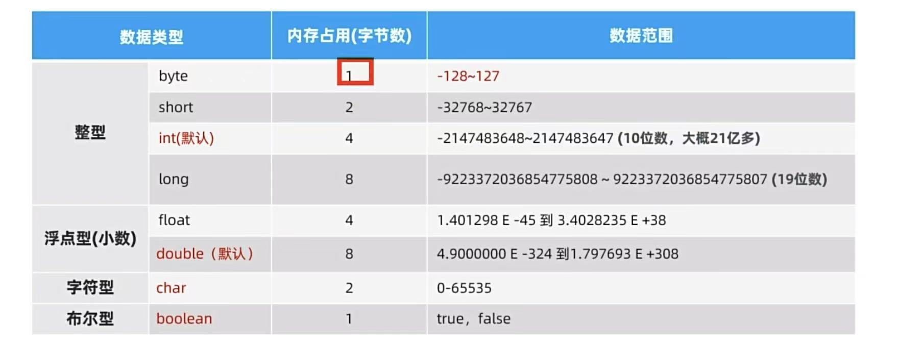

### Day1 基础语法

#### 1. 数据类型



#### 2. 方法的重载
函数名称相同，参数列表不同即为重载
```java
public class MethodReload {
    public static void main(String[] args) {
        print("'reload'");
        print(12, "上海");
    }
    public static void print(String name) {
        System.out.println(name);
    }
    public static void print(int age, String address) {
        System.out.println(age + address);
    }
}
```

#### 3. 类型转换与表达式类型提升
1. 自动转换：大类型 = 小类型
2. 强制转换：小类型 = (大类型) 小类型的值
3. 表达式类型提升：表达式的结果类型为成员中最大的类型, 例如下列res为double, 成员最大类型23.243345。
    ```java
   double res = 2 + "a" + '1' + 23.243345;
   ```

#### 4. 输入输出
```java
// 1. 输出
System.out.println();
// 2. 输出
Scanner s = new Scanner(System.in);
double aDouble = s.nextDouble();
String aDouble = s.nextLine();
```

#### 5. 逻辑运算符与三目运算符
1. 逻辑运算符：与JavaScript中一致。
2. 三目运算符：与JavaScript中一致。

#### 6. 分支语句
条件、分支、循环都和JavaScript一致。


### Day2 面向对象（一）

#### 一. 封装
1. 对象基本定义
   ```java
    class Person {
        private String name;
        public Person() {}
        public Person(String name) {
            this.name = name;
        }
        public String getName() {
            return name;
        }
        public void setName(String name) {
            this.name = name;
        }
        @Override
        public String toString() {
            return "Person{" +
                    "name='" + name + '\'' +
                    '}';
        }
    }
   ```
2. 构造器

   - 类默认会创建一个无参构造器
   - 构造器重载

   ```java
   class PersonClass {
   
       private String name;
       private int age;
       private String address;
   
       public PersonClass() {}
   
       public PersonClass(String name, int age, String address) {
           this.name = name;
           this.age = age;
           this.address = address;
       }
   }
   ```
3. 封装
4. 实体类
   
   1.实体类满足一下条件
   - 成员私有化
   - 至少有一个无参构造器
   - 提供getter和setter方法
   
   2.实体类一般用来做数据存储，具体业务交给其他类或者方法
   
   ```java
   class EntrieAnimal {
       private String name;
       public EntrieAnimal() {}
       public String getName() {
           return name;
       }
       public void setName(String name) {
           this.name = name;
       }
   }
   ```
5. 静态成员和静态方法
   - 静态方法和静态成员属于类，不属于实例对象，类的实例对象共享同一份静态成员和方法，类加载时存在，在内存中只存在一份。
   - 可以在类的内不和外部使用，可以通过类名或者实例对象去访问，一般推荐使用类名访问。

#### 二. 继承
1. 继承
2. 权限访问修饰符
3. 继承的特点
4. 方法重写
5. 子类构造器特点
6. 子类构造器中使用兄弟构造器

#### 三. 多态
1. 多态
2. 多态的好处以及存在的问题
3. 多态下的类型转换以及注意事项
4. 多态案例

### Day3 面向对象（二）
#### 一. final 关键字
1. final 关键字与常量
2. 单例模式

#### 二. 枚举类
1. 枚举类的定义以及状态枚举
2. 枚举类的应用场景

#### 三. 抽象类
1. 抽象类的特点
2. 抽象类的好处
3. 模版设计模式

#### 四. 接口
1. 接口的定义以及特点
2. 接口的好处
3. JDK 8 之后新增特性
4. 抽象类和接口的区别

